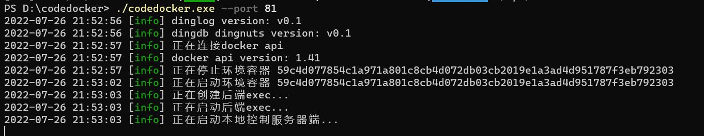

# codedocker

## 用途

用于在线运行代码

用于在docker容器中便捷的运行go和php的代码，调用api，统一管理。

应用场景，golang、php代码在线运行。

能轻松拓展支持在线运行其他语言的代码

## 原理

主控端用于管理创建和构建docker容器，即后文中所说的环境容器，以及检查环境容器和被控端的状态，随时修复和重建环境容器。

环境容器中包含golang环境和php环境。以及生成被控端。

被控端用于开始、结束编译以及获取运行的结果。

## 优点

环境容器的image只需要在程序初次运行时进行构建。

环境容器与主环境隔离，不会受到恶意代码的损坏。

环境容器容易修复和重新生成。

golang支持外部包的使用，php支持扩展和三方扩展的安装。与传统JavaScript解释器相比，更为真实。

golang生成被控端。程序效率高。高并发。

易于上手，易于二次开发。

熟悉golang和docker api的开发者可以很轻松地拓展codedocker对于其他语言的支持。环境容器中已经附带g++（用于对cgo进行处理）

## 程序结构

主控端为主文件夹的内容

dockerfile以及被控端在docker文件夹中和docker\base文件夹中

## 程序开发环境

deepin + docker api(1.41) + golang 1.8.*

## 程序运行前置条件

安装docker

## 用法说明

默认情况下（即没有任何选项）

第一次运行会自动build 环境容器的image。生成并启动环境容器。启动主控端。

第二次及以后运行会自动启动或重启环境容器。并启动主控端。

### 命令行选项

#### --clean

清除缓存。可用于需要重新初始化的情况

#### --debug

启动Debug Mode，输出部分调试信息

#### --port

指定主控端端口

#### --ContainerPort

指定被控端端口（该选项只在初始化时生效，后期除非重新初始化否则不得更改）

## 已知问题

### Windows

- 编译时需注释tools.BuildDockerFileTar(logger, RunPath)这一行（main文件中）

  然后打包docker文件夹下所有文件为Dockerfile.tar.gz放置到docker目录下。

- ...

### Linux

- ...

### mac

- ...

## 编译方法

Go版本需要大于1.8

```sh
go build
```

## api列表

### 主控端

- [POST] /api/check 无参数     检查被控端及环境容器是否正常

  示例返回：

  ```json
  {
  	"status": "ok"
  }
  ```

- [POST] /api/getapi   无参数   获取被控端api地址

  示例返回：

  ```json
  {
  	"api": "http://127.0.0.1:7000/run",
  	"status": "ok"
  }
  ```

- [POST] /api/fix    无参数    尝试修复被控端和环境变量，当check出问题时使用

  示例返回：

  ```json
  {
  	"status": "ok"
  }
  ```

### 被控端

- [POST] /run   参数：code、language   code为要运行的代码，language为要运行的语言(支持php&&go)

  示例返回：

  ```json
  {
  	"message": "hello,world\n",
  	"status": 0
  }
  ```

  返回信息说明：

  message为输出结果，若运行失败为错误信息

  #### status

  - 0 为运行成功
  - 1 为创建文件夹失败
  - 2 为创建文件失败
  - 3 为编译失败
  - 4 为运行失败

## 运行截图



## 作者

丁丁(dinglz)  QQ:1149978856

## 开发灵感

一时想要搭建一个在线运行代码的平台。上网找了几圈，没有合适的后端，大多为JavaScript解释器。当即自己写了一款，满足自己的需要，已经运用在个人的在线代码运行平台上。

## 欢迎各位开发者Star或参与开发！

## 更多语言正在开发中...